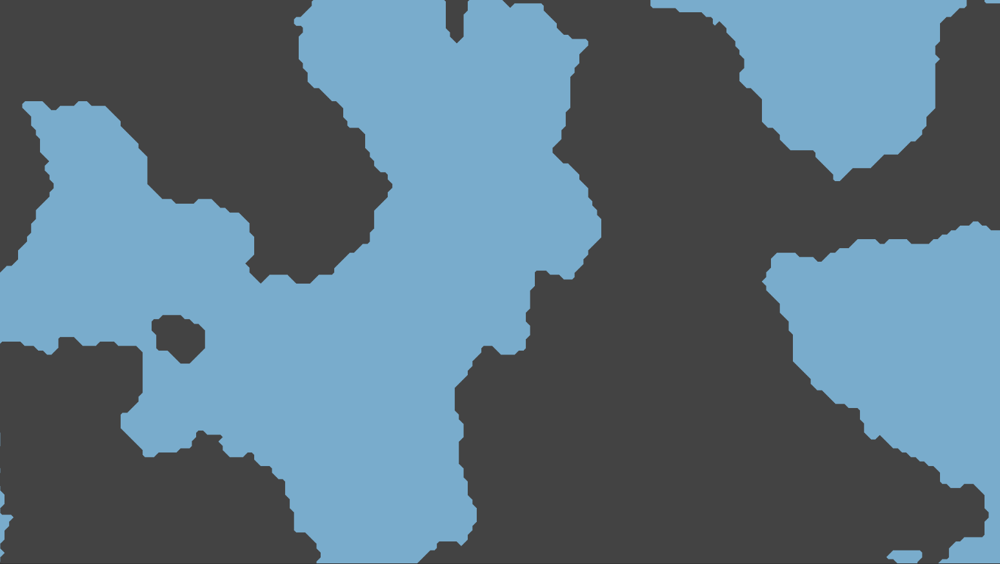

# Marching-Squares

Implementation of Marching Squares to Procedurally Generate a Mesh From Grid.

# Mesh Optimization

## Before

## After

# Example : Metaball

---

## License

This project is licensed under the MIT License - see the [LICENSE](LICENSE) file for details